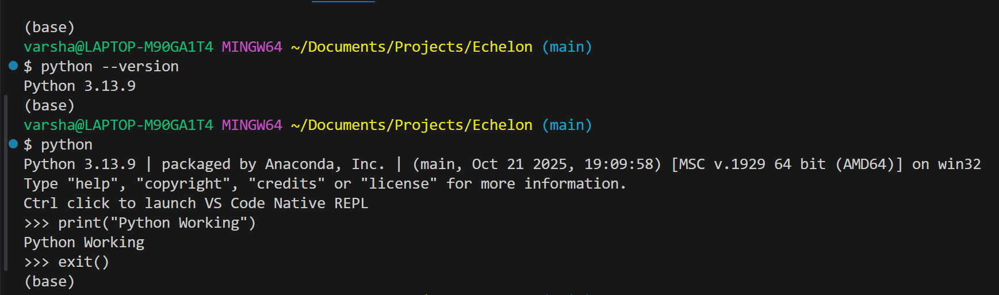
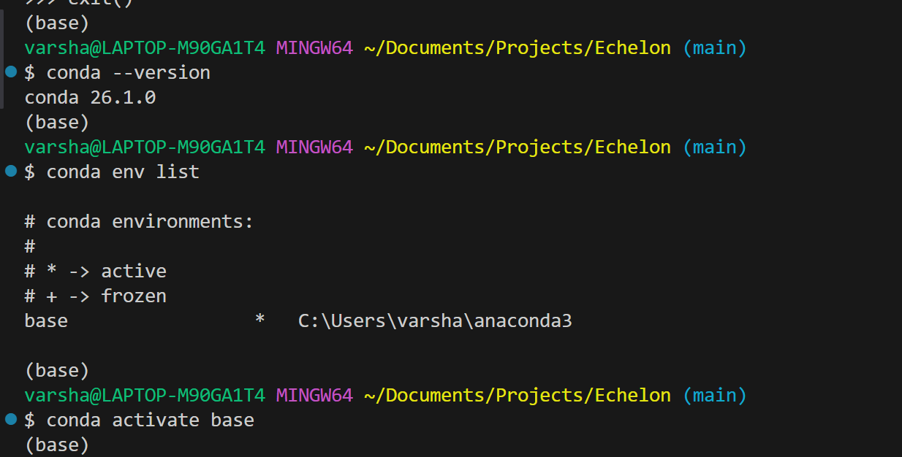
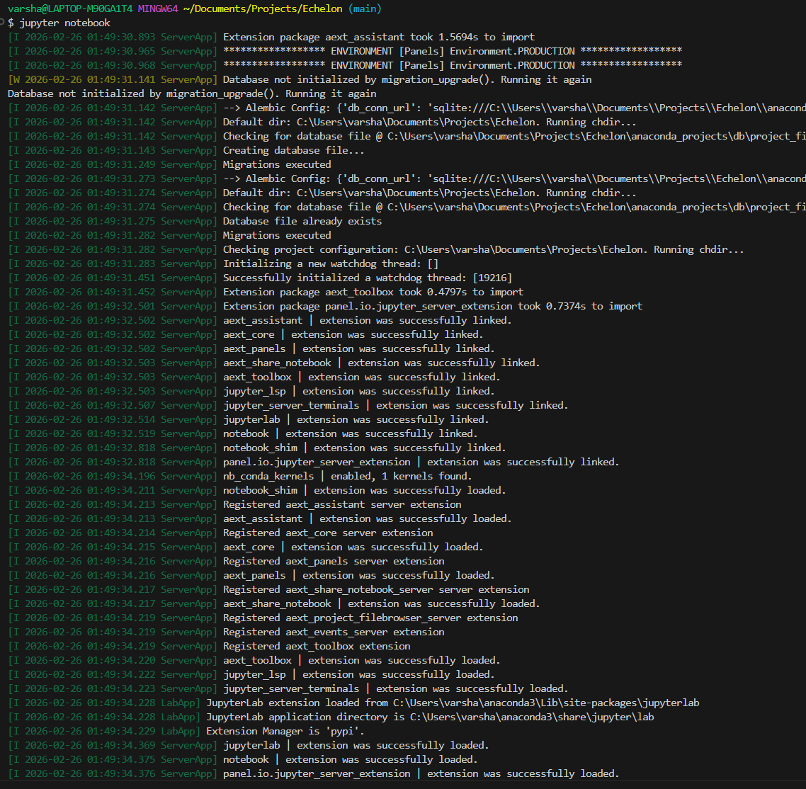

    # Echelon - Role-Aware Privileged Access Risk Scoring System with Usage Intelligence

-----------------------------------------------------------

## Problem Statement

Modern enterprises rely on privileged users such as system
administrators, database administrators, and cloud engineers who possess
elevated access to critical systems and sensitive data. While such
access is essential for operations, over time the actual usage of
granted privileges may diverge from what was originally assigned. This
leads to governance blind spots, persistent over-privileging, behavioral
instability, and elevated organizational risk.

Traditional access control systems such as RBAC determine whether access
is permitted but do not assess how access is used after it is granted.
Rule-based monitoring systems focus on threshold violations and fail to
detect gradual behavioral drift, privilege redundancy, or peer-relative
deviations.

This project designs and implements a role-aware, data-driven, and
machine-learning--based risk scoring system that analyzes privileged
user behavior, learns role-specific usage patterns, identifies
behavioral deviation and privilege--usage misalignment, tracks temporal
stability, and produces interpretable, continuous risk scores without
relying on labeled incident data.

------------------------------------------------------------------------

## What We Are Solving

We are solving a governance visibility problem, not a threat detection
problem.

**Core Question:**\
Among users who are legitimately allowed to access sensitive systems,
whose access patterns indicate increasing governance risk,
over-privilege, or behavioral inconsistency compared to peers in the
same role?

The system does NOT: 
- Detect malicious intent
- Block access
- Enforce policies

The system DOES: 
- Measure behavioral deviation
- Quantify privilege--usage misalignment
- Track behavioral stability over time
- Provide explainable governance risk scores

------------------------------------------------------------------------

## End-to-End System Flow

Access Logs → Data Cleaning → Feature Engineering → Role-Based
Segmentation → Representation Learning → Behavioral Clustering →
Deviation & Misalignment Modeling → Temporal Stability Analysis →
Ensemble Risk Scoring → Explainable Governance Insights

------------------------------------------------------------------------

## Data Description

Simulated enterprise privileged access logs.

### Dataset Columns

-   user_id
-   role (DB_Admin, HR_Admin, Cloud_Admin)
-   resource_type
-   action (read, write, delete, export)
-   timestamp
-   session_duration
-   access_volume
-   success_flag

No malicious/normal labels are included by design.

------------------------------------------------------------------------

## Data Science Phase

### Data Cleaning

-   Handle missing values
-   Standardize column names
-   Convert timestamp into datetime
-   Remove duplicates
-   Validate data types

### Feature Engineering (Core DS Work)

**Access Behavior Features** 
- Average access volume per day
- Export action ratio
- Unique resources accessed
- Average session duration

**Temporal Features** 
- Night access percentage
- Weekend activity ratio
- Access time variance

**Stability Features** 
- Week-over-week change
- Sudden access spikes

**Statistical Analysis** 
- Mean, variance, standard deviation
- Z-score comparison against role averages

### Governance Risk Index (Statistical)

Risk Index = Weighted combination of standardized deviations.

Normalize final score to 0-100.

**Risk Categories** 
- 0-30: Low Risk
- 31-60: Medium Risk
- 61-100: High Risk

------------------------------------------------------------------------

## Machine Learning Phase

### Unsupervised Anomaly Detection

Algorithm: Isolation Forest\
Purpose: Learn normal behavior per role and detect deviations without
labels.

### Representation Learning

Technique: PCA or Autoencoders\
Purpose: Reduce feature dimensionality and capture latent behavioral
structure.

### Behavioral Clustering

Algorithms: K-Means / DBSCAN\
Purpose: Identify access archetypes and behavioral segments.

### Distance-Based Risk Modeling

Techniques: Euclidean / Mahalanobis Distance\
Purpose: Quantify privilege--usage misalignment.

### Temporal Drift & Stability Modeling

Rolling statistics, variance tracking, trend detection.\
Purpose: Detect long-term instability and governance risk.

### Ensemble Risk Scoring

Combine: 
- Anomaly score
- Misalignment score
- Cluster rarity score
- Temporal instability score

Final risk = Aggregated normalized ensemble score.

### Explainable ML

Feature deviation ranking, Z-score explanation, cluster comparison.\
Provide human-readable governance insights.

------------------------------------------------------------------------

## Final Outputs

-   User-level risk score table
-   Role-wise risk distribution plots
-   Temporal risk trends
-   Explainable risk factor summaries
-   Governance prioritization list

------------------------------------------------------------------------

## Tools & Technologies

Programming: Python\
Data Handling: Pandas, NumPy\
Visualization: Matplotlib, Seaborn\
Machine Learning: Scikit-learn\
Optional Dashboard: Streamlit

------------------------------------------------------------------------

## Conclusion

This project demonstrates end-to-end data science and machine learning
applied to a realistic enterprise governance problem. It combines
feature engineering, statistical modeling, unsupervised learning,
ensemble risk synthesis, temporal analysis, and explainability to build
a decision-support system that enhances privileged access governance.

---


---
## Installing Python and Anaconda on Local Machine

### Objective

This milestone ensures that the local system is properly configured for
Data Science and Machine Learning development.\
The setup establishes a stable environment that will be used throughout
the sprint for notebooks, scripts, ML models, and deployment workflows.

------------------------------------------------------------------------

### System Information

-   **Operating System:** Windows 11 (64-bit)
-   **Python Version:** 3.13.9 (Anaconda distribution)
-   **Anaconda Version:** Conda 26.1.0
-   **Active Environment:** base

------------------------------------------------------------------------

### Installation Process

**1. Python Verification**

Python was verified through the terminal using the following commands:

python --version

Output:

Python 3.13.9

Python interactive shell test:

python print("Python Working") exit()

Output:

Python Working



------------------------------------------------------------------------

**2️. Anaconda Installation & Verification**

Anaconda was installed using the official Windows installer.

*Verification commands:*

conda --version conda env list

*Output:*

conda 26.1.0

*conda environments:*

# 

#### base \* C:`\Users`{=tex}`\varsha`{=tex}`\anaconda3`{=tex}

*Environment activation:*

conda activate base




------------------------------------------------------------------------

**3️. Environment Validation**

The environment was validated by:

-   Launching Python via terminal
-   Running a basic print statement
-   Confirming Conda environment activation
-   Ensuring Jupyter Notebook can launch successfully

Command used:

jupyter notebook

Jupyter successfully started at:

http://localhost:8888/



------------------------------------------------------------------------
## Project Structure

The project is organized into the following directory structure:

``` 
echelon/
├── README.md
├── requirements.txt
├── .gitignore
├── data/
│ ├── raw/
│ ├── processed/
│ └── external/
├── notebooks/
│ ├── 01_data_exploration.ipynb
│ ├── 02_data_cleaning.ipynb
│ ├── 03_feature_engineering.ipynb
│ ├── 04_statistical_analysis.ipynb
│ └── 05_visualization.ipynb
├── src/
│ ├── data/
│ ├── features/
│ ├── visualization/
│ └── utils/
├── outputs/
│ ├── figures/
│ └── reports/
├── docs/
│   ├── setup_verification.png
│   ├── project_plan.md
│   └── data_dictionary.md
└── scripts/
    ├── generate_data.py
    └── run_analysis.py
```


---

## Folder Overview

### data/
Stores datasets used in the project.
- **raw/** – Original immutable data files.
- **processed/** – Cleaned and transformed data.
- **external/** – Optional reference datasets.

### notebooks/
Contains the step-by-step analytical workflow:
1. Data Exploration  
2. Data Cleaning  
3. Feature Engineering  
4. Statistical Analysis  
5. Visualization  

### src/
Reusable Python modules organized by responsibility:
- **data/** – Data loading and cleaning logic  
- **features/** – Feature engineering logic  
- **visualization/** – Plotting utilities  
- **utils/** – Helper functions  

### outputs/
Generated artifacts:
- **figures/** – Charts and visualizations  
- **reports/** – Generated summaries and documentation  

### docs/
Project documentation and planning materials.

### scripts/
Standalone scripts for automation (e.g., data generation and pipeline execution).

---

## Data Flow

→ Raw Data  
→ Cleaning  
→ Feature Engineering  
→ Statistical Analysis  
→ Visualization & Reporting  

This structure ensures modularity, reproducibility, and scalability for further Machine Learning integration.


# Understanding the Machine Learning Workflow

## Project Context: Role-Aware Privileged Access Risk Scoring System

This document explains the complete machine learning workflow as applied to the Echelon: ML-Powered Privileged Access Governance System project.

---

## 1. The Complete ML Workflow

### Full Pipeline Overview

```
Raw Data → Feature Engineering → Model Training → Prediction → Evaluation → Monitoring
```

### Stage-by-Stage Breakdown

#### **Stage 1: Raw Data**

The starting point of any ML system. Raw data is unprocessed information collected from operational systems.

**In Echelon Project:**

- Privileged access logs containing: `user_id`, `role`, `resource_type`, `action`, `timestamp`, `session_duration`, `access_volume`, `success_flag`
- 12,500 raw access events from 100 privileged users (DB_Admin, HR_Admin, Cloud_Admin)
- Data exists in its original form with no transformations applied

**Characteristics:**

- Contains noise, missing values, inconsistencies
- Not directly usable by ML algorithms
- Represents business events, not mathematical patterns

#### **Stage 2: Feature Engineering**

The process of transforming raw data into meaningful numerical representations that capture behavioral patterns.

**In Echelon Project:**

**Access Behavior Features:**

- `avg_daily_access`: Mean number of access events per day per user
- `export_ratio`: Percentage of actions that are data exports (risk indicator)
- `unique_resources`: Count of distinct systems accessed
- `avg_session_duration`: Average time spent in privileged sessions

**Temporal Features:**

- `night_access_pct`: Percentage of access during 10 PM - 6 AM (deviation from normal hours)
- `weekend_activity_ratio`: Weekend access compared to weekday baseline
- `access_time_variance`: Inconsistency in access timing patterns

**Stability Features:**

- `weekly_access_change`: Week-over-week volatility in access volume
- `access_spike_score`: Detection of sudden abnormal access bursts

**Why This Matters:**

Raw timestamps mean nothing to an ML model. Converting them into `night_access_pct` transforms business context (working hours) into a numerical pattern the model can learn.

#### **Stage 3: Model Training**

The process where algorithms learn patterns, distributions, and relationships from engineered features.

**In Echelon Project:**

**Unsupervised Learning Models Used:**

- **Isolation Forest:** Learns what "normal" access behavior looks like per role, identifies deviations
- **K-Means Clustering:** Discovers 4 distinct user archetypes (Standard, Export-Heavy, Night-Shift, Volatile)
- **PCA (Principal Component Analysis):** Reduces 9 features to 3 core behavioral dimensions
- **Local Outlier Factor:** Learns local density patterns to detect peer-relative anomalies
- **Mahalanobis Distance:** Learns role-specific statistical distributions and covariance structures

**What Models Learn:**

- Role-specific normal distributions (e.g., DB_Admins typically access 15-25 resources; 40+ is unusual)
- Feature correlations (high `export_ratio` often correlates with high `unique_resources`)
- Cluster centroids representing access archetypes
- Statistical boundaries separating normal from anomalous behavior

**Critical Insight:**

Models DO NOT learn "this user is malicious." They learn "this user's pattern deviates X standard deviations from their role's typical behavior."

#### **Stage 4: Prediction**

Applying trained models to generate risk scores for governance decision-making.

**In Echelon Project:**

**Prediction Outputs:**

- **Anomaly Risk Score (0-100):** How unusual is this user compared to role peers?
- **Cluster Assignment:** Which behavioral archetype does this user belong to?
- **Temporal Drift Score (0-100):** Is behavior becoming more unstable over time?
- **Ensemble ML Risk Score (0-100):** Weighted combination of 6 ML model outputs

**Example Prediction:**

```
User: DB_ADMIN_042
- Anomaly Risk: 78/100 (high deviation)
- Cluster: "Export-Heavy" archetype
- Temporal Drift: 65/100 (increasing risk trend)
- Final ML Risk: 72/100 → HIGH RISK CATEGORY
```

**Actionable Governance Output:**

This user should undergo immediate privilege review due to export-heavy behavior and increasing instability.

#### **Stage 5: Evaluation**

Assessing whether predictions are reliable and aligned with governance objectives.

**In Echelon Project:**

**Evaluation Metrics Used:**

- **Silhouette Score (0.62):** Measures cluster quality; confirms 4 distinct behavioral groups exist
- **Explained Variance (78.3%):** PCA retains most behavioral information in 3 components
- **Statistical Correlation (ρ = 0.82):** ML risk scores strongly correlate with statistical baseline (confirms model validity)
- **Category Agreement (78%):** ML and statistical models agree on risk categorization for most users

**Validation Strategy:**

- Compare ML outputs against statistical z-score baseline
- Verify cluster profiles match domain expectations (Export-Heavy cluster should have high `export_ratio`)
- Check temporal trends for logical consistency (risk should not randomly fluctuate)

**Why This Matters:**

Without evaluation, you might deploy a model that appears to work but actually learned spurious patterns or suffers from data leakage.

#### **Stage 6: Monitoring**

Continuously tracking model performance and data quality in production.

**In Echelon Project (Production Deployment):**

**What Gets Monitored:**

- **Data Drift:** Are new access patterns shifting away from training distribution? (e.g., sudden remote work policy changes behavior)
- **Prediction Drift:** Are risk score distributions changing over time?
- **Feature Distribution:** Is `night_access_pct` suddenly spiking across all users? (indicates policy change, not individual risk)
- **Model Staleness:** Quarterly retraining required to incorporate evolving role norms

**Alert Triggers:**

- Mean risk score increases by >10 points across entire population (data drift)
- Cluster sizes drastically change (new behavioral archetypes emerging)
- Feature correlations break down (access patterns fundamentally changing)

---

## 2. Real-World Example: Privileged Access Governance

### Application: Enterprise Cybersecurity Governance

#### Raw Data

Access logs from privileged users:

```
user_id: DB_ADMIN_042
role: DB_Admin
resource_type: Customer_Database
action: export
timestamp: 2024-03-15 02:34:12 AM
session_duration: 47 minutes
```

#### Feature Engineering

Transform logs into governance-relevant metrics:

- **Night Access Pattern:** This user accessed systems at 2:34 AM (unusual)
- **Export Behavior:** 18% of actions are exports (2x role average of 9%)
- **Access Volatility:** Week-over-week access varies by 42% (unstable)

#### What the Model Learns

- Isolation Forest learns that DB_Admins typically have 5-12% export ratio; 18% is an outlier
- K-Means discovers this user belongs to "Export-Heavy" cluster (high governance risk archetype)
- Temporal Drift Model learns this user's export ratio increased from 8% (Q1) to 18% (Q4) — gradual privilege creep

#### Prediction

**Ensemble ML Risk Score: 72/100 (HIGH RISK)**

**Contributing Factors:**

- Anomaly Score: 78/100 (export ratio deviation)
- Temporal Drift: 65/100 (increasing trend)
- Cluster Rarity: 45/100 (Export-Heavy is uncommon archetype)

**Recommendation:** Immediate privilege review required

#### Business Impact

Governance team receives explainable risk score without needing to:

- Manually review 12,500 access events
- Define arbitrary thresholds (e.g., "more than X exports = risky")
- Wait for a security incident to occur

---

## 3. Failure Scenario: Concept Drift in Privileged Access Governance

### Failure Point: Monitoring Stage

#### Scenario:

The Echelon system is deployed in January 2024. The ML models are trained on 6 months of historical access data where:

- Normal working hours: 9 AM - 5 PM (office-based)
- `night_access_pct` baseline: 5-8% (occasional after-hours work)
- Weekend activity baseline: Low

#### What Goes Wrong:

In July 2024, the organization implements a global remote work policy. Behavior fundamentally changes:

- Engineers in different time zones access systems at "night" (relative to HQ timezone)
- Weekend activity increases as work-life boundaries blur
- `night_access_pct` across ALL users jumps from 7% → 22%

#### Impact on ML System:

**Without Monitoring:**

- The model still uses January baselines where 22% night access was "extremely anomalous"
- Every user now gets flagged as high-risk due to `night_access_pct` deviation
- False positive rate skyrockets
- Governance team loses trust in the system
- ML Risk Scores become meaningless

**Why This Happens:**

- **Concept Drift:** The relationship between features and risk has changed (night access is no longer a risk indicator)
- **Data Distribution Shift:** Feature distributions no longer match training data
- **Model Staleness:** Models learned patterns from a different operational reality

#### How Monitoring Would Detect This:

**Drift Detection Metrics:**

- **Feature Distribution Monitoring:** Alert when `night_access_pct` population mean shifts by >10%
- **Prediction Drift:** Alert when >30% of users are flagged as high-risk (expected rate: 15%)
- **Cluster Migration:** Alert when users mass-migrate to "Night-Shift Workers" cluster

**Corrective Actions:**

- **Retrain Models:** Use July-December 2024 data reflecting new work patterns
- **Feature Re-engineering:** Introduce timezone-aware features instead of absolute time-based features
- **Baseline Adjustment:** Recalibrate what "normal" `night_access_pct` means post-policy change
- **Feedback Loop:** Incorporate governance team feedback on false positives

**Lesson:**

Machine learning is not "set it and forget it." Real-world environments evolve. Monitoring ensures models adapt to changing conditions rather than degrading silently.

---

## 4. Scenario-Based Reasoning

### Question:

A company builds a churn prediction model that performs well during testing. After deployment, accuracy slowly decreases over six months. What stage of the ML workflow is likely failing, and why?

### Answer:

**Failing Stage: Monitoring**

**Root Causes:**

**1. Data Drift (Most Likely):**

- - Customer behavior has changed since training (e.g., new product launch, competitor entry, economic conditions)
- Feature distributions no longer match training data (e.g., `average_purchase_frequency` decreasing industry-wide due to recession)
- The model's learned patterns (e.g., "customers with 3+ support tickets churn") may no longer hold true

**2. Concept Drift:**

- The relationship between features and churn has changed
- Example: Previously, "low app usage" predicted churn. Now, customers reduce usage but stay subscribed due to new pricing model changes.

**3. Missing Feedback Loop:**

- The model was evaluated on historical test data where ground truth was known
- Post-deployment, no system tracks actual churn outcomes vs. predictions
- Model degradation goes unnoticed because monitoring was not implemented

**Why Monitoring Matters:**

- **Detection:** Drift detection metrics (feature distribution shifts, prediction confidence changes) would alert the team
- **Diagnosis:** Monitoring reveals which features are drifting (e.g., `customer_tenure` distribution shifted)
- **Action:** Triggers model retraining with recent data reflecting current customer behavior

**Solution:**

- Implement continuous monitoring of feature distributions and prediction performance
- Set up automated retraining pipelines triggered by drift thresholds
- Establish feedback loops to collect ground truth labels (actual churn) post-deployment
- Compare live predictions vs. actual outcomes monthly

**Key Insight:**

Testing accuracy measures "how well the model learned historical patterns." Monitoring ensures "those patterns still apply to current reality." Without monitoring, models silently become obsolete.

---

## 5. Key Takeaways

### Models Learn From Features, Not Raw Meaning

- A model doesn't understand "night access is risky because it's unusual."
- It learns "feature value 22 is 3 standard deviations from role mean of 7 → assign high anomaly score."

### Feature Engineering Often Determines Success

- In Echelon, converting timestamps → `night_access_pct` is what enables the model to detect temporal deviations.
- Poor features = poor model performance, regardless of algorithm choice.

### Evaluation Prevents False Confidence

- Echelon validates ML outputs against statistical baseline (ρ = 0.82 correlation confirms models learned real patterns, not noise).

### Monitoring Prevents Silent Degradation

- Remote work policy change would silently break the model without drift detection.
- Most ML failures in production are monitoring failures, not algorithm failures.

### ML Systems Are Data Pipelines, Not Just Models

- Training the model is ~20% of the work.
- Data cleaning, feature engineering, evaluation, monitoring, and explainability are the other 80%.

---

## 6. Conclusion

The machine learning workflow is not a linear sequence but a continuous cycle:

```
Data → Features → Model → Prediction → Evaluation → Monitoring → 
    ↑                                                          |
    └──────────────── Retrain & Improve ───────────────────────┘
```

In the Echelon Privileged Access Governance System, this workflow enables:

- Automated detection of governance risks without labeled incident data
- Explainable risk scores for security teams
- Adaptation to evolving organizational access patterns through monitoring

Understanding this workflow is essential for building production-ready ML systems, not just research experiments.


